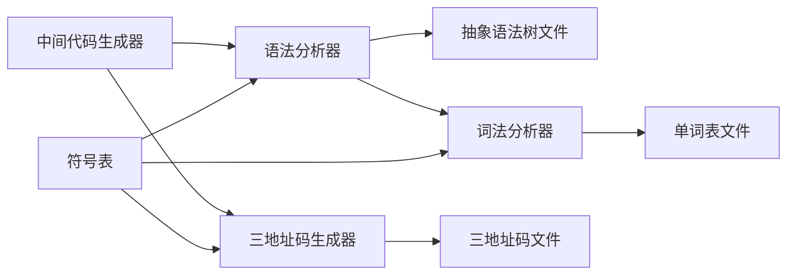
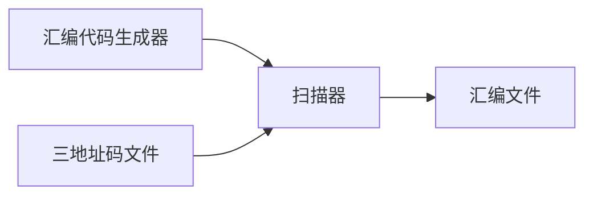
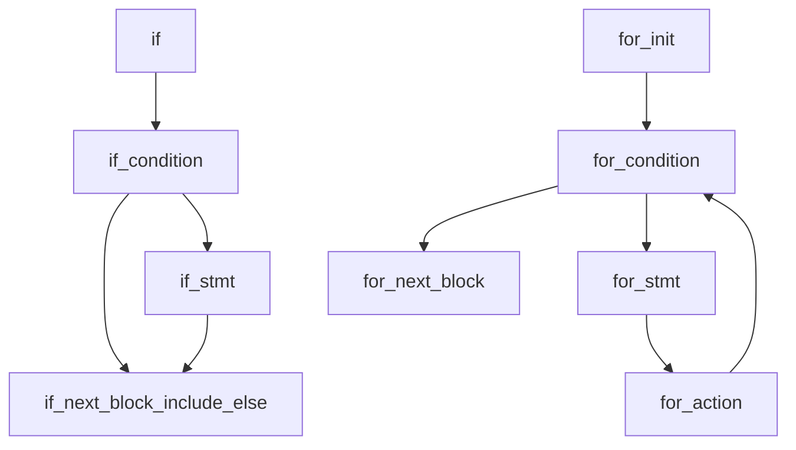

# 编译原理课程实验报告

<p align="right">2021.01.15 Fri.</p>

项目仓库地址：`https://gitee.com/eternallyascend/compiler`同时导入`GitHub`仓库。

### 代码分工

| 项目                                                   | 负责人                                                       |
| ------------------------------------------------------ | ------------------------------------------------------------ |
| 词法分析器 `c.l` 与符号表 `item.*` `tree.*` `table.*`  | 于海龙                                                       |
| 语法分析器 `c.y` `pointer.*`                           | 朱振毅(声明/抽象树/错误处理)<br />于海龙(运算/控制流/错误处理) |
| `makefile` `file.*` `shell`                            | 于海龙                                                       |
| 三地址码 `indirectTriple.*`                            | 于海龙                                                       |
| 中间代码生成 `c.y`                                     | 于海龙(运算/控制流)/朱振毅(声明)                             |
| 类型检查 `c.y`                                         | 朱振毅(声明)/于海龙(运算)                                    |
| 汇编代码生成<br /> `ass.h` `assfunction.c` `assmain.c` | 王昊天(生成器主程序/运算符)<br />刘方圆(启动/寻址/跳转/运算符)<br />金羽童(关系运算符/运算符/IO) |
| 代码优化`c.y`  `promote.*` `assfunction.c`             | 全体成员                                                     |


### 项目架构

程序整体流程如下：


其中`中间代码生成器`结构如下：



中间代码生成器调用词法分析器识别句型，并由语法分析器调用词法分析器识别单词，生成单词表和抽象语法树文件，三地址码生成器根据抽象语法树指针遍历生成三地址码文件。

其中`汇编代码生成器`结构如下：



汇编代码生成器使用扫描三地址码文件的方式获取代码信息并生成汇编文件，汇编文件经由汇编器生成二进制可执行文件。


### 主要思路

#### 词法与语法部分

使用编译原理的基本方法实现一个简单的编译器，`词法分析器`和`语法分析器`按照标准的`Lex`和`Yacc`规范进行代码编写，文件`item.*`表示符号表项，其内容包括：

| Name       | Value   | Description                |
| ---------- | ------- | -------------------------- |
| `name`     | `char*` | 变量名                     |
| `type`     | `int`   | 变量类型                   |
| `store`    | `int`   | 变量存储长度（未分配为-1） |
| `position` | `char*` | 变量存储位置               |

文件`tree.*`表示采用哈希表为节点的作用域树，文件`table.*`表示符号表对外暴露的接口，在`file.*`文件中实现了对单词表的追加输出，输出至`timestamp-lex.txt`文件中。最初使用的C语言版本自建哈希表Stack存储于`symbolTableInC`文件夹下，一遍扫描的编译程序可以使用以节约空间。

语法中数组与指针部分的实现如下：

```yacas
array -> [single_expr] array'
array' -> [single_expr] | epsilon
pointer -> * pointer | epsilon
address -> & | epsilon
arg -> address pointer IDENTIFIER array
```


#### 抽象语法树部分

剔除一些不必要的节点后，只在有需要的地方对树进行操作。直接地添加子节点并构建连接会有一些顺序问题，于是在插入子节点的过程中穿插对树的旋转操作，并追踪当前节点。旋转处：二元运算符，声明列表，for的三个子句。将匹配单词，是否为终结符，子结点地址和个数等信息存在节点中。最终通过`file.*`输出至`timestamp-yacc.txt`文件。

语法树样例如下：

​															声明

​			基本类型				声明单元				声明单元			……

​										变量名							=

​						（含数组、指针修饰） 	（代表有初始化）

​																变量名			初始化表达式

​													（含数组、指针修饰）


#### 类型检查部分

构建一个type类型数据，以一个整数序列存储数组（指针）的信息，数字代表数组长度（-1代表指针）。每个运算单元的节点都有一个该类型指针。

在声明语句中将数组（指针）类型的数据及其类型注册到表中。

使用时的类型传递规则：每次调用&，加一个-1；每次调用*或[]，去掉开头，若长度不符或序列为空，报错。

类型的大小为：

​		`size`(基本类型) `*`(变量的类型中从开头到第一个-1的乘积, 不计算-1).

如：

```C
int a[1][2];						// 对应{1，2} 大小为(1*2)*int
int *b[5];							// 对应{5, -1} 大小为5*pointer
&a;									// {-1, 1, 2} 大小为pointer
a[0];								// {2}
*b;									// {-1}
b[7];								// 7 >= 5 报错
```

地址计算：&直接取址。 *地址不变。

[expr]	偏移子类型长度 * expr的值。

当序列为空时，需寻址。此时类型不再为数组或指针。


#### 中间代码生成部分

由于采用去除左递归和左公因子的文法格式，没有采用一遍扫描的方法在生成抽象语法树的同时生成中间代码，因此采用对抽象语法树的遍历实现，采用`switch-case`结构对不同产生式的节点进行操作，待析构时将三地址码指令序列通过`file.*`输出至`timestamp-code.txt`文件中，若中途出现错误则不会输出代码序列，并在输出流中输出错误信息。

其中重要的控制流语句包括`if`和`for`的具体实现贴至附录，其余请参见`c.y`文件`indirectTripleCodeGenerator`函数。




#### 汇编代码生成部分

从三地址码文件读入按行翻译，并为跳转语句分块，生成正确的汇编文件。


#### 代码优化部分

对于出口不活跃的变量以及临时变量，对其间接三地址码码进行删除操作。对于变量，为寄存器的分配根据使用情况进行调整，减少对内存的读取和回写操作。


### 问题与解决

1. 最开始误认为是LL文法，因此对文法进行了消除左递归和左公因子的操作，导致后期常常出现冲突的情况，通过阅读`Yacc`程序生成的`report`文件解决。
2. `if-else`二义性问题，采用优先级规则优先匹配`else`解决。
3. 构建抽象树时，出现了不少错位问题。需要耐心的一点点推导、模拟、修正。
4. 初步添加`error`时出现冲突问题，`error`的位置不能重叠，否则会出现冲突。
5. 无法在消除左递归和左公因子后的产生式中直接生成一些语句的三地址码，使用二次遍历抽象语法树的方法解决。
6. 跳转位置的判断。最初的方案时使用偏移量判断。后来发现此方法很难实现，而且汇编语言中已经包含了关键字跳转的方法。最后决定使用关键字跳转的方法：由于读取三地址码的方式是按行读取，按行调用函数生成汇编，所以每个生成汇编的函数增加了一个字符串类型参数（行号）。在每次输出第一句汇编代码之前先输出L+行号+冒号，代表这行三地址码对应的汇编代码。在跳转时就可以直接使用行号对应的关键字进行跳转了。
7. 寻址问题，`assFind`函数支持获取某地址下的值。获取数组元素时需要调用`assOffset`函数取得该元素地址，用`assFind`函数取得该元素的值。在测试中发现一个问题，修改数组元素值后该值并没有发生改变。后来发现`assFind`函数只能取得一个值并且赋值给一个变量，然后对这个变量进行了赋值，并没有直接改变原数组中的值。后发现问题出在赋值上，赋值应该是对`assOffset`取得的地址下的值进行赋值。后来修改了三地址码的表示，将需要找地址赋值的操作的表示进行了修改，并且增加了一种针对地址的赋值方式，解决了这个问题。
8. 问题：读取文件方式，返回行数，需要按行读；存储三地址码，需要每个字符串读取。解决：读取行数：`fgets`；读取字符串：`fscanf`。
9. 问题：转成汇编的除法没有结果。解决：汇编除法只能多位除以少位，例如16位除以8位；所以用`ax`除以`bl`即可。


### 附录

#### 中间代码生成`if` 和`for`的源代码

```C
case _IF:
    indirectTripleCodeGenerator(node->child[0], instruction); // CONDITION
    node->begin = node->child[0]->begin;
    node->trueList = makeNewTemp(instruction, generateIndirectTriple("j", node->child[0]->value, "_"));
    node->falseList = makeNewTemp(instruction, generateIndirectTriple("j", "_", "_"));
    indirectTripleCodeGenerator(node->child[1], instruction); // STMT
    node->isNotEmpty = 1;
    if (-1 != node->child[1]->begin) {
        node->isNotEmpty = 0;
        sprintf(go, "%d", node->child[1]->begin);
        rewriteTemp(instruction, node->trueList, 2, go);
    }
    if (3 == node->size) {
        node->head = makeNewTemp(instruction, generateIndirectTriple("j", "_", "_"));
        // ELSE;
        indirectTripleCodeGenerator(node->child[2], instruction);
        sprintf(go, "%d", node->child[2]->begin);
        rewriteTemp(instruction, node->falseList, 2, go);
        node->end = node->child[2]->end;
        sprintf(go, "%d", node->end + 1);
        rewriteTemp(instruction, node->head, 2, go);
    }
    if (2 == node->size) {
        node->end = node->child[1]->end;
        if (-1 == node->end) {
            node->end = node->falseList;
        }
        sprintf(go, "%d", node->end + 1);
        rewriteTemp(instruction, node->falseList, 2, go);
    }
    if (node->isNotEmpty) {
        rewriteTemp(instruction, node->trueList, 2, go);
    }
    break;
case _ELSE:
    indirectTripleCodeGenerator(node->child[0], instruction);
    node->begin = node->child[0]->begin;
    node->end = node->child[0]->end;
    break;
case _IF_STMT:
    if (0 == node->size) {
        break;
    }
    indirectTripleCodeGenerator(node->child[0], instruction);
    node->begin = node->child[0]->begin;
    node->end = node->child[0]->end;
    break;
case _IF_CONDITION:
    indirectTripleCodeGenerator(node->child[0], instruction);
    node->begin = node->child[0]->begin;
    sprintf(node->value, "%s", node->child[0]->value);
    node->end = node->child[0]->end;
    break;
// ========== ========== ========== ========== ========== ========== ==========
case _FOR:
    pushScope(0);
    node->begin = makeNewTemp(instruction, generateIndirectTriple("j", "_", "_"));
    node->end = makeNewTemp(instruction, generateIndirectTriple("j", "_", "_")); 
    indirectTripleCodeGenerator(node->child[0], instruction);
    sprintf(go, "%d", node->child[0]->begin);
    rewriteTemp(instruction, node->begin, 2, go);
    node->head = node->child[0]->head;
    indirectTripleCodeGenerator(node->child[1], instruction);
    sprintf(go, "%d", node->child[1]->begin);
    rewriteTemp(instruction, node->child[0]->child[1]->head, 2, go); 
	// condition -> jump to stmt head.
    rewriteTemp(instruction, node->child[1]->end, 2, go);
    sprintf(go, "%d", node->child[0]->child[1]->begin);
    rewriteTemp(instruction, node->child[0]->child[2]->end, 2, go); 
	// action -> jump to condition head.
   sprintf(go, "%d", node->child[0]->child[2]->begin);
   jump = makeNewTemp(instruction, generateIndirectTriple("j", "_", "_"));
   rewriteTemp(instruction, jump, 2, go);
   sprintf(go, "%d", jump + 1);
   rewriteTemp(instruction, node->end, 2, go);
   rewriteTemp(instruction, node->child[0]->child[1]->end, 2, go);
   popScope();
   break;
case _FOR_INIT:
   if (0 == node->size) {
       break;
   }
   indirectTripleCodeGenerator(node->child[0], instruction);
   node->begin = node->child[0]->begin;
   node->end = node->child[0]->end;
   break;
case _FOR_CONDITION:
   if (0 == node->size) {
       break;
   }
   indirectTripleCodeGenerator(node->child[0], instruction);
   node->begin = node->child[0]->begin;
   node->type = node->child[0]->type;
   sprintf(node->value, "%s", node->child[0]->value);
   node->head = makeNewTemp(instruction, generateIndirectTriple("j", node->value, "_"));
   if (-1 == node->begin) {
       node->begin = node->head;
   }
   node->end = makeNewTemp(instruction, generateIndirectTriple("j", "_", "_"));
   break;
case _FOR_ACTION:
    if (0 != node->size) {
        indirectTripleCodeGenerator(node->child[0], instruction);
        node->begin = node->child[0]->begin;
    }
    node->end = makeNewTemp(instruction, generateIndirectTriple("j", "_", "_"));
    if (-1 == node->begin) {
        node->begin = node->end;
    }
    break;
case _FOR_EXPRESSION:
    indirectTripleCodeGenerator(node->child[0], instruction); // INIT
    node->begin = node->child[0]->begin;
    indirectTripleCodeGenerator(node->child[1], instruction); // COND
    if (-1 == node->begin) {
        node->begin = node->child[1]->begin;
    }
    node->head = node->child[1]->begin;
    indirectTripleCodeGenerator(node->child[2], instruction); // ACTION
    if (-1 == node->begin) {
        node->begin = node->child[2]->begin;
    }
    if (-1 == node->head) {
        node->head = node->child[2]->begin;
    }
    break;
```

